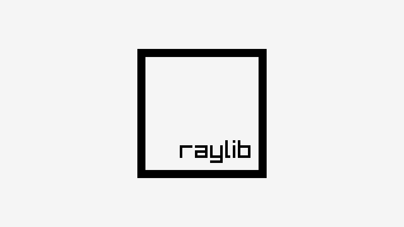

# orbisGl2samples
orbisGl2 raylib samples for liborbis

## EXAMPLES LIST

### category: shapes

Examples using raylib shapes drawing functionality, provided by raylib.

| ## | example  | image  | developer  | new |
|----|----------|--------|:----------:|:---:|
| 24 | [shapes_bouncing_ball](shapes/shapes_bouncing_ball/source/shapes_bouncing_ball.c)                     |                      | ray                                        | ⭐️     |
| 26 | [shapes_logo_raylib](shapes/shapes_logo_raylib/source/shapes_logo_raylib.c)                         |                          | ray                                        |        |
| 27 | [shapes_logo_raylib_anim](shapes/shapes_logo_raylib_anim/source/shapes_logo_raylib_anim.c)               |                | ray                                        |        |
| 28 | [shapes_rectangle_scaling](shapes/shapes_rectangle_scaling/source/shapes_rectangle_scaling.c)             |              | [Vlad Adrian](https://github.com/demizdor) |        |
| 30 | [shapes_collision_area](shapes/shapes_collision_area/source/shapes_collision_area.c)                   |                    | ray                                        | ⭐️     |

### category: textures

Examples using raylib textures functionality, including image/textures loading/generation and drawing, provided by raylib 

| ## | example  | image  | developer  | new |
|----|----------|--------|:----------:|:---:|
| 48 | [textures_logo_raylib](textures/textures_logo_raylib/source/textures_logo_raylib.c)                   |                    | ray                                              |        |
| 60 | [textures_background_scrolling](textures/textures_background_scrolling/source/textures_background_scrolling.c) |  | ray                                              | ⭐️     |

### category: models

Examples using raylib models functionality, including models loading/generation and drawing

| ## | example  | image  | developer  | new |
|----|----------|--------|:----------:|:---:|
| 67 | [models_box_collisions](models/models_box_collisions/source/models_box_collisions.c)                   |                    | ray                                              |        |
| 68 | [models_cubicmap](models/models_cubicmap/source/models_cubicmap.c)                               |                                | ray                                              |
| 72 | [models_mesh_generation](models/models_mesh_generation/source/models_mesh_generation.c)                 |                  | ray                                              |        |

As always contributions are welcome, feel free to send new examples! Here it is an [examples template](examples_template.c) to start with!